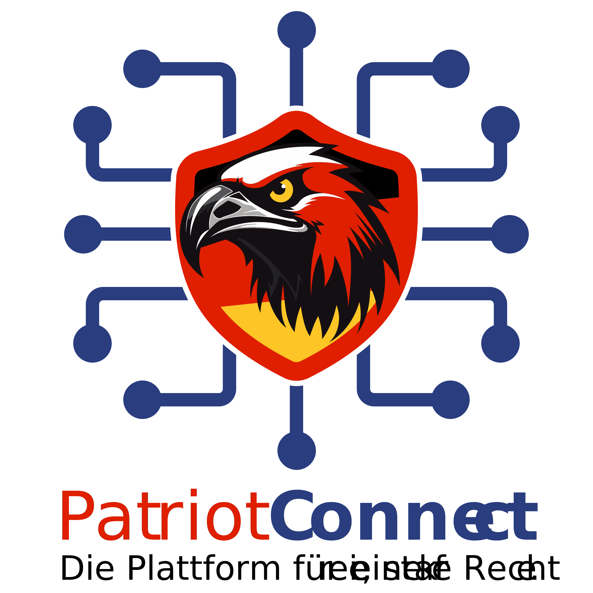

# PatriotConnect – Digitale Infrastruktur für patriotische Parteiarbeit

**PatriotConnect** ist eine modulare, skalierbare Architekturbasis zur Digitalisierung patriotischer Organisationen, Projekte und Strukturen. Entwickelt mit dem Ziel, die organisatorische, kommunikative und operative Arbeit der Partei, Stiftungen und politischen Netzwerken effizient, sicher und zukunftsfähig zu gestalten.

  

---

## 🎯 Ziel des Projekts

PatriotConnect stellt keine einzelne Anwendung dar – sondern ein **technologisches Fundament**, auf dem digitale Werkzeuge für die patriotische Bewegung entwickelt, vernetzt und betrieben werden. Im Mittelpunkt steht die **professionelle, modulare Digitalisierung** der Parteiarbeit und angrenzender Strukturen und Organisationen.

---

## 🧱 Architektur & Grundidee

PatriotConnect basiert auf einem **Microservice-fähigen Modularsystem**. Die Komponenten kommunizieren über eine zentrale API-Struktur und können individuell erweitert oder ausgelagert werden.

**Technologische Basis:**

- **Backend**: Node.js, Express, MongoDB
- **Frontend** (geplant): React (Web), Flutter (App)
- **Deployment**: Docker-Multicontainer, NGINX Load-Balancing, GitHub Actions
- **Kommunikation**: REST-API, Telegram-Bot (geplant), ICS-Exportschnittstellen
- **Datenstruktur**: Sauber getrennte Entitäten wie Events, Sprecher, Orte, Organisationen

---

## 📦 Module & Anwendungsbereiche

PatriotConnect kann durch spezialisierte Dienste und Module erweitert werden, z. B.:

- **Veranstaltungsverwaltung**  
  → zentrale Eventdatenbank mit Filterfunktionen & Exports  
- **Organisationsstruktur**  
  → Verwaltung von Landes-, Kreis- und Stadtverbänden inkl. Typen und Formen  
- **Sprecher- & Personalstruktur**  
  → Zuordnung von Personen, Referenten, Mandatsträgern zu Terminen & Themen  
- **Orts-/Regionsdatenbank**  
  → konsistente und wiederverwendbare Ortsdaten für Veranstaltungen & Bezirksstrukturen  
- **Benachrichtigungen & Bots**  
  → automatisierte Infos per Telegram & Mail (geplant)

---

## 🛠️ Aktueller Projektstatus

| Modul                   | Status        | Hinweise                        |
|------------------------|---------------|---------------------------------|
| Event-API              | 🟢 In Entwicklung | Basis-CRUD & Filter vorhanden   |
| Speaker-Modul          | 🟢 In Entwicklung | Eigene Collection & Services    |
| Organizer-System       | 🟢 In Entwicklung | Typ & Form als Substruktur      |
| Location-System        | 🟢 In Entwicklung | Mit Option für Custom-Orte      |
| ICS-Export             | ⚪ Geplant      | Für Kalenderintegration         |
| Telegram-Bot           | ⚪ Geplant      | Modul in Konzeptphase           |
| Admin-Frontend (React) | ⚪ Geplant      | UI für Datenpflege              |
| Flutter-App            | ⚪ Geplant      | Mobile Nutzung                  |

---

## 🔐 Prinzipien & Philosophie

- **Unabhängigkeit**: Eigenentwickelte Infrastruktur ohne BigTech Cloud-Abhängigkeit
- **Souveränität**: Datenhoheit bleibt bei den Organisationen
- **Modularität**: Es gibt Core-Module und Features als austauschbare indviduelle unabhängige Module
- **Langfristigkeit**: Entwicklung mit Fokus auf Erweiterbarkeit & Stabilität
- **Effizienz**: Schnelle Ladezeiten, einfache Bedienung, automatisierbare Abläufe

---

## 🤝 Zielgruppe

PatriotConnect richtet sich an:

- die AfD (mit ihren Gliederungen & Mandatsträgern)
- parteinahe Stiftungen und Bildungsinitiativen
- patriotische Bürgernetzwerke & Vereine
- technische Teams, die patriotische Digitalinfrastruktur aufbauen wollen

---

## 📂 Diese öffentliche Repository enthält

- Logos & Design-Richtlinien
- Präsentationen zur Vorstellung von PatriotConnect
- Architekturskizzen & Roadmap
- Öffentlich freigegebene Informationen (kein Quellcode)

> 🔒 Für interne technische Dokumentation siehe private Repositories.

---

## 📢 Kontakt & Mitwirkung

Du möchtest das Projekt unterstützen oder Feedback geben?

📧 **Steven Weißheimer**  
✉️ [afd@stevenweissheimer.com](mailto:afd@stevenweissheimer.com)  
🌐 [stevenweissheimer.com](https://stevenweissheimer.com)

---

© 2025 – PatriotConnect ist ein Infrastrukturprojekt zur Stärkung patriotischer Strukturen in Deutschland.
